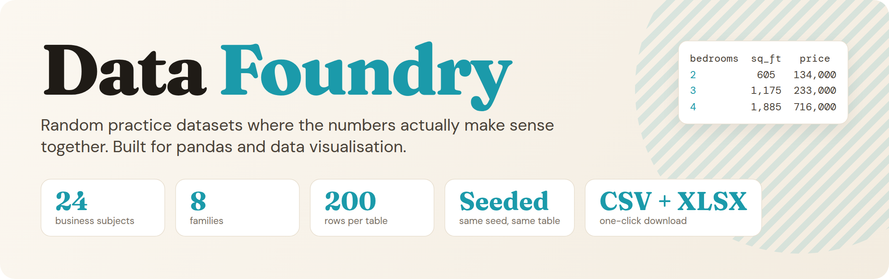
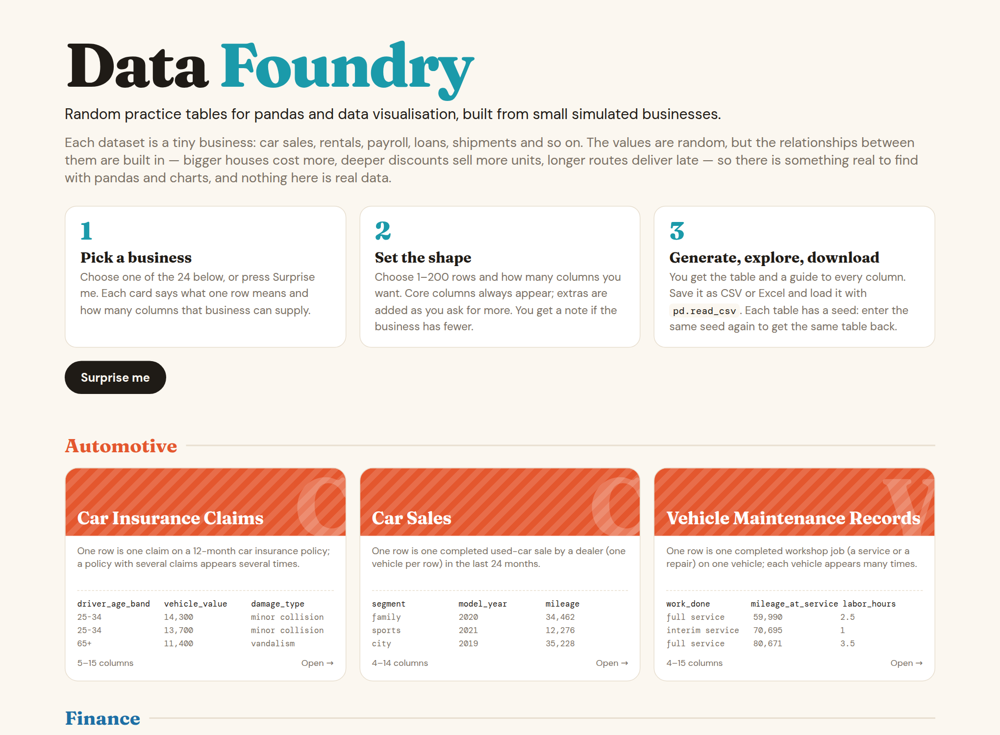
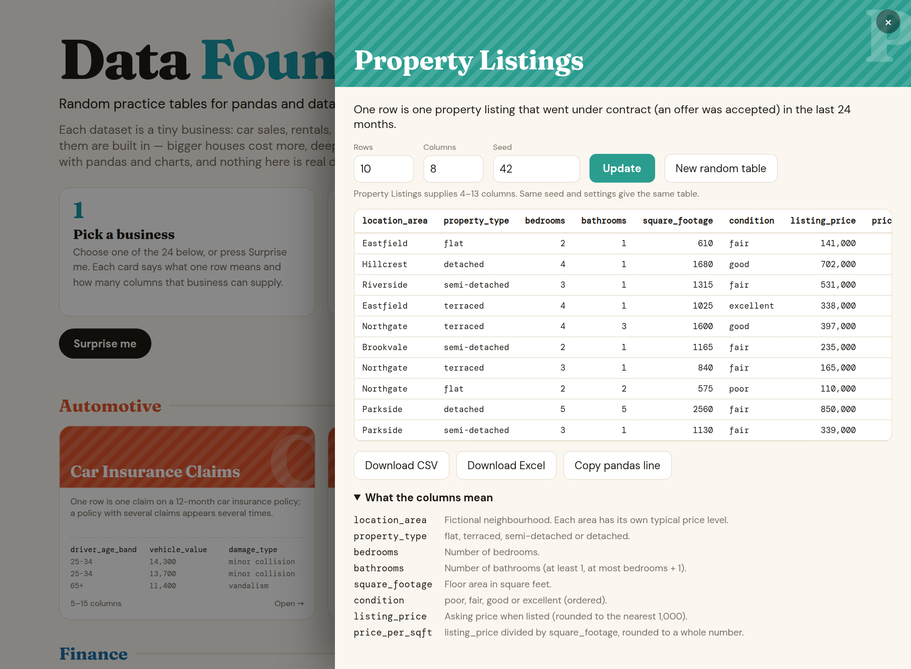
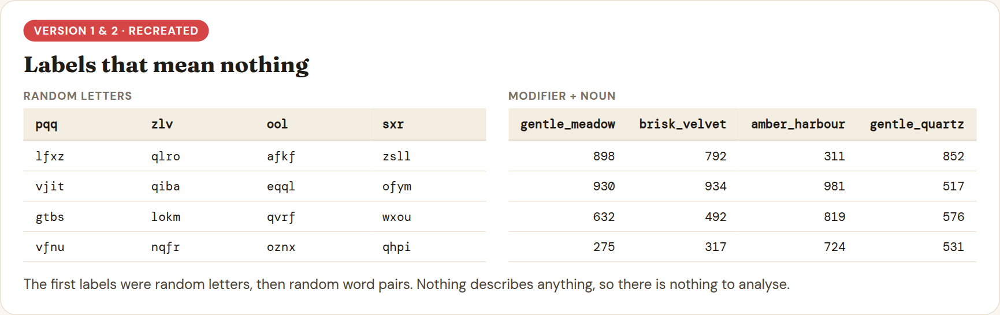
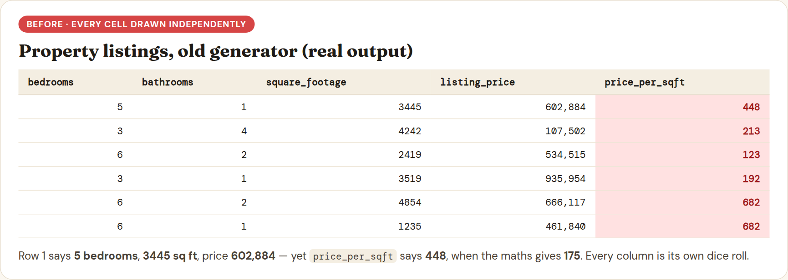
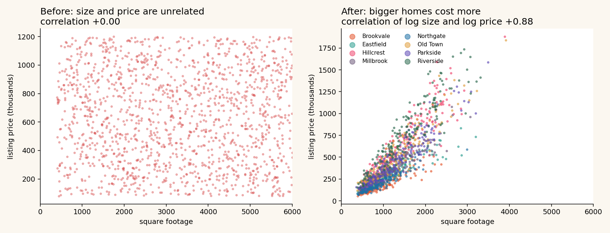
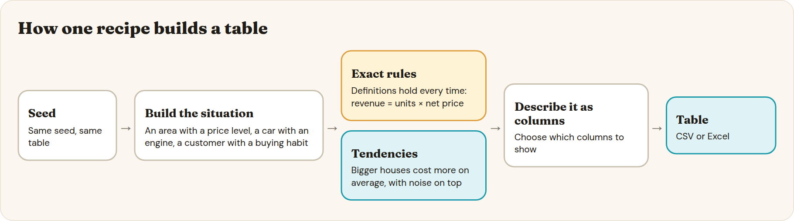
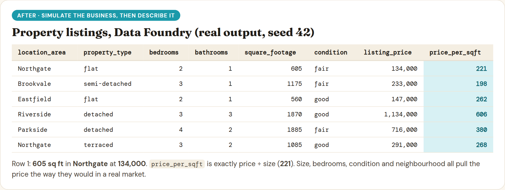

<div align="center">

<br><br>

</div>

---

## ✨ What it is

This is the **standalone app**: it runs on your own computer (Linux, macOS or Windows), with nothing
to host and nothing sent anywhere. The live website version is a separate project, `TidyWeb/data-foundry`.

Pick a business, choose up to **200 rows** and the number of **columns**, then view the table, read
the column guide, and download it as **CSV** or **Excel**.

The values are random. The relationships between them are built in: bigger houses cost more,
deeper discounts sell more units, longer routes deliver late. So there is something real to find
with pandas and charts, and nothing here is real data.

Every table has a **seed**. The same subject, settings, seed and date always give the same table.

<div align="center">

</div>

## 🗂️ 24 subjects, 8 families

| Family | | | |
|---|---|---|---|
| 🚗 **Automotive** | Car Sales | Car Insurance Claims | Vehicle Maintenance Records |
| 🏠 **Real Estate** | Property Listings | Rental Property Management | Property Maintenance Records |
| 🛒 **Retail** | Retail Product Sales | Inventory Management | Customer Purchase Behaviour |
| 🏭 **Manufacturing** | Manufacturing Production Output | Quality Control & Defects | Factory Energy Usage |
| 💷 **Finance** | Company Financial Performance | Investment Portfolio Returns | Loan & Credit Risk |
| 👥 **HR** | Payroll & Compensation | Employee Performance Reviews | Recruitment & Hiring |
| ☁️ **SaaS** | Customer Churn & Subscriptions | Product Usage Analytics | Customer Support Tickets |
| 🚚 **Logistics** | Shipping & Delivery | Warehouse Operations | Supplier & Vendor Performance |

---

## 🧭 How it got here

### 1. A simple idea

A small web page and a pandas script that make a random table for practice: choose rows and columns,
download CSV or Excel.

### 2. Random labels were useless

The first column names and values were random letters, then random modifier-and-noun pairs.
Nothing meant anything. The fix was themed vocabularies, so a car sales table talked about cars and
a payroll table about employees.

<div align="center">

</div>

### 3. Meaningful words, meaningless numbers

Every cell was still drawn on its own, so the numbers had no connection to the words beside them.
A three-bedroom house could cost more than a six-bedroom one. A three-cylinder city car could have
V8 power. Here is the old generator's real output:

<div align="center">

</div>

Plotted, it is a cloud. Size tells you nothing about price (left). Sprinkling a "row quality score"
over independent draws only patched the symptoms, so the whole approach had to change.

<div align="center">

</div>

### 4. Simulate the business, then describe it

The generator was rebuilt around **one recipe per subject**. Each recipe first builds a coherent
situation, then writes it out as columns:

<div align="center">

</div>

- **Exact where it is a definition.** Price per square foot is price divided by size, every time.
- **Statistical where it is a tendency.** Bigger houses cost more on average, with noise on top.
- **Entities persist.** A vehicle or customer that appears in many rows behaves consistently.

The same property listings, from the new generator:

<div align="center">

</div>

### 5. Check it, don't trust it

`foundry/validate.py` runs every recipe across many seeds and row counts. Exact rules must hold
every time, tendencies must hold in nearly all runs, and the same seed must reproduce the same
table. **All 24 subjects pass 40 seeds at 200 and 3,000 rows.**

### 6. Stateless by design

The first web app kept the last table in a global variable, which breaks as soon as two people use
it. Now every table is rebuilt from its web address: the app is **stateless**, downloads always
match the screen, and there is no database.

### 7. Messy data on demand

Real data is never this tidy, so every table can be switched from **Clean** to **Messy**. The clean
table is built first and never changed; a separate step (`foundry/faults.py`) then damages a copy,
and the same seed always gives the same mess. Every change is written to a downloadable **answer key**
(row, column, problem, original value, messy value), and undoing the key gives back the clean table
exactly. Nothing on screen highlights the damage.

| Problem | How | Rate |
|---|---|---|
| Missing values | blank, N/A, null, -, ? | 3-8% of cells in 2-4 columns |
| Numbers stored as text | "1,250", "£40.99", "40,99", trailing space | 4-8% in 1-2 numeric columns |
| Dates in other formats | 15/06/2025, 06-15-2025, 15 Jun 2025, 20250615 | 20-40% in 1-2 date columns |
| Invalid dates | 31/02/2025, TBC | 1-2% |
| Casing, stray spaces, typos | UPPER / Title, padded text, swapped or dropped letters | 5-10%, 3-6%, 1-3% |
| Mixed True/False | Yes/No, Y/N, 1/0, true/FALSE | 15-30% of one Boolean column |
| Outliers and impossible values | x10, x100, negatives, 999999 or -1 | 0.5-1.5% |
| Duplicate rows | exact copies | 1-3% of rows |
| Conflicting duplicate IDs | same ID, different value | 0.5-1% |
| Messy headers | Title Case, UPPER, camelCase, trailing space | about half of the headers |
| Stray rows | a repeated header row and a blank row | once each |

Overall about 5-12% of cells are damaged, so the table stays workable. A messy table has a few more
rows than requested (duplicates and stray rows), and the page says so.

### 🚧 Not done yet

- Some tendencies are weaker at very small row counts.
- A few time-based subjects cover only a short date span at small sizes.

---

## 🚀 Run it

You need Python 3.13 or later ([python.org](https://www.python.org/downloads/)).

**Easiest: the download.** Get `data-foundry-standalone-0.1.0.zip` from the
[Releases](../../releases) page, unzip it, then start it:

| System | How |
|---|---|
| Windows | double-click `Start Data Foundry.bat` |
| macOS | double-click `Start Data Foundry.command` (first time: right-click, Open) |
| Linux | run `./start.sh` in a terminal |

Linux: run `./install-linux-launcher.sh` once to add Data Foundry to your applications menu with its own icon, then pin it to the taskbar from there.

Your browser opens on Data Foundry. The first start sets itself up and needs an internet connection
for a minute or two; after that it starts straight away and works offline. Close the window to stop.

**From source** (this repository):

```bash
python -m venv venv
source venv/bin/activate          # Windows: venv\Scripts\activate
pip install -r requirements.txt
flask --app app run
```

Then open http://127.0.0.1:5000. The fonts are bundled and the page makes no requests to outside
servers.

> **Status:** the Linux launcher is tested. The Windows and macOS launchers are written but have not
> been tested yet.

## 🧱 Project layout

```
app.py                 the Flask app: pages and download routes
templates/  static/    the page, styles, self-hosted fonts
foundry/
  core.py              seeds, column choice, shared helpers
  display.py           names, colours and number formatting for the page
  faults.py            messy-data layer and answer key
  recipes/             one file per subject (24)
  validate.py          validation harness
start.sh  Start Data Foundry.*   launchers for Linux, macOS and Windows
tools/make_standalone_zip.py   builds the downloadable zip
tests/smoke_test.py    checks every subject through the app: pages, downloads, seeds, messy data
tests/faults_test.py   checks the messy-data layer and its answer key
docs/img/              images used in this README
```

## 🛠️ Development

```bash
pip install -r requirements-dev.txt
python tests/smoke_test.py             # every subject, downloads, seeds, bad input, messy data
python tests/faults_test.py            # messy-data layer: reproducible, key undoes the mess
python -m foundry.validate --seeds 25  # relationship checks for every subject
```

## 📄 Licence

MIT, see `LICENSE`. Fonts (Fraunces, DM Sans, DM Mono) are under the SIL Open Font Licence, see
`static/fonts/LICENSES.txt`.
